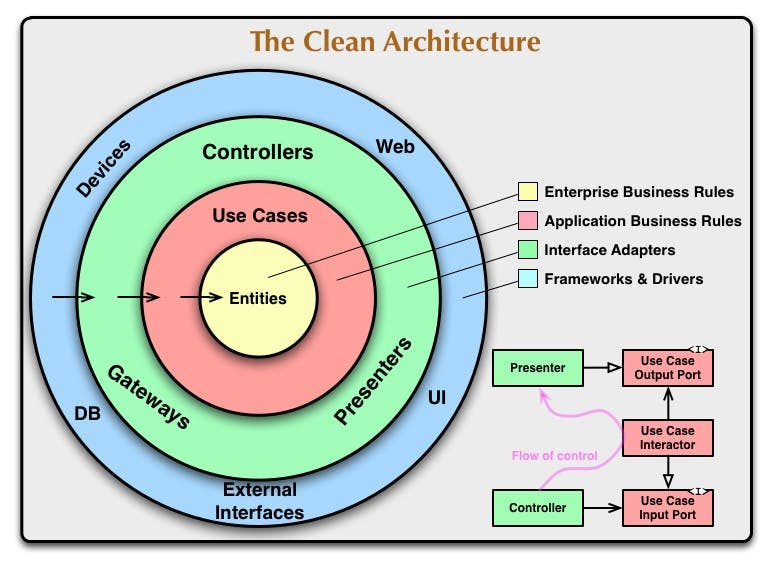

# go-architecture-template

go-architecture-template is a sample project that demonstrates how to structure a Go application using a modular architecture. The project is divided into multiple packages, each of which is responsible for a specific part of the application's functionality. This makes the code easier to understand and maintain, and it also makes it easier to add new features to the application.




In this project devide four layer

* `models`
* `usecase`
* `repository`
* `handler`

## Features

- Clean project structure based on domain-driven design principles.
- Separation of concerns with clear boundaries between layers.
- Environment using echo.
- Docker support for containerization.

## Getting Started

1. Clone the repository:

   ```bash
   git clone https://github.com/IanNarsa/go-architecture-template.git
   ```

2. Navigate to the project directory:

   ```bash
   cd go-architecture-template
   ```

3. Install dependencies:

   ```bash
   go mod download
   ```

4. Build and run the application:

   ```bash
   go run cmd/main.go
   ```

## Project Structure

The project follows a structured architecture with clear separation of concerns:

- **cmd:** Application entry points and executable files.
- **config:** Configuration setup and management.
- **internal:** Core application logic.
  - **handler:** HTTP request handlers.
  - **repository:** Data access and storage.
  - **usecase:** Business logic and domain services.
  - **model:** Sturct models.

## Usage

The API provides the following endpoints:

* `GET  /customers`: Gets all customers.
* `GET  /products`: Gets all products.
* `GET  /product/:productCode`: Gets a selected product.
* `POST /order-product`: Orders a product.


## License

This project is public.

---

Feel free to customize this template to provide more specific information about your project.


> Refrence: https://hackernoon.com/creating-clean-architecture-using-golang-9h5i3wgr